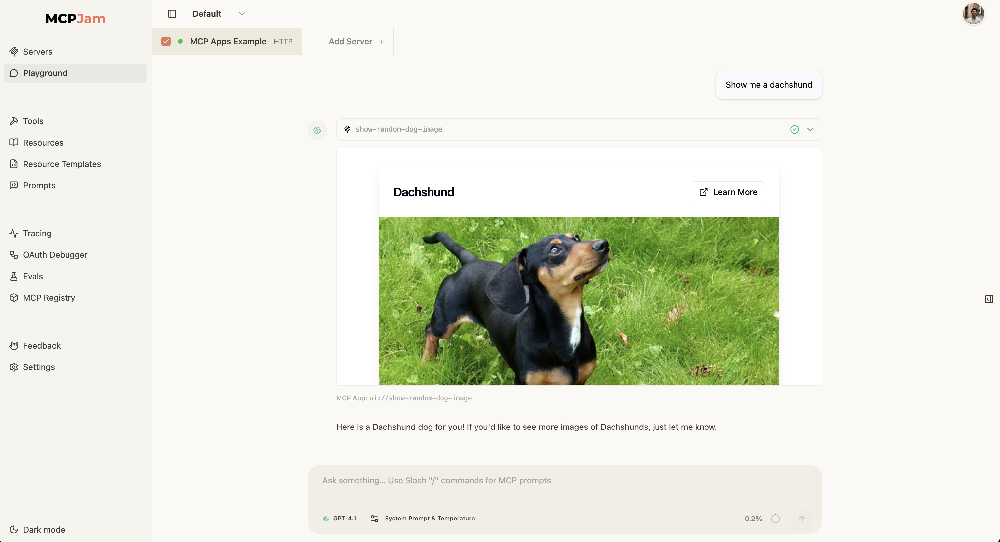

# Cute Dogs MCP Server (MCP Apps UI)

An MCP (Model Context Protocol) server + MCP Apps UI that provides interactive widgets and tools for browsing and viewing dog images from the [Dog CEO API](https://dog.ceo/dog-api/).

This example server demonstrates the full MCP Apps capabilities with a React example:

- Render React UI widgets. The UI is hydrated by data passed in from the MCP tool via `structuredContent`
- Call tool within widget
- Send follow up message
- Open external link



## Installation

Install all dependencies:

```bash
npm i
```

Then start the server

```bash
npm run start
```

The terminal will then print out text `MCP Server listening on http://localhost:3001/mcp`. Connect to the MCP server with the localhost link.

## Tools

The server provides three MCP tools:

### 1. `show-random-dog-image`

Shows a dog image in an interactive UI widget. The image is displayed in the widget, not in the text response.

**Parameters:**

- `breed` (optional): Dog breed name (e.g., `"hound"`, `"retriever"`). If not provided, returns a random dog from any breed.

**Widget:** `dog-image-view`

**Example:**

```json
{
  "name": "show-random-dog-image",
  "arguments": {
    "breed": "hound"
  }
}
```

### 2. `all-breeds-view`

Shows all available dog breeds in an interactive UI widget. Users can click on any breed to send a message to the chat requesting that breed.

**Parameters:** None

**Widget:** `all-breeds-view`

**Example:**

```json
{
  "name": "all-breeds-view",
  "arguments": {}
}
```

### 3. `get-more-images`

Fetches multiple random dog images from a specific breed. Returns an array of image URLs. This tool is typically called from within the `dog-image-view` widget to load additional images.

**Parameters:**

- `breed` (required): The dog breed name (e.g., `"hound"`, `"retriever"`)
- `count` (optional): Number of images to fetch (1-30). Defaults to 3 if not provided.

**Widget:** None (programmatic tool)

**Example:**

```json
{
  "name": "get-more-images",
  "arguments": {
    "breed": "hound",
    "count": 5
  }
}
```

## How this server is compiled

1. **Source Files** → React components written in TypeScript/TSX:
   - `src/dog-image-view.tsx` - The React component for displaying dog images
   - `src/all-breeds-view.tsx` - The React component for showing all breeds

2. **HTML Entry Points** → Simple HTML files that load the React components:
   - `dog-image-view.html` - Loads `dog-image-view.tsx` via a script tag
   - `all-breeds-view.html` - Loads `all-breeds-view.tsx` via a script tag

3. **Vite Build Process** → When you run `npm run build`:
   - Vite compiles each HTML file separately (using the `INPUT` environment variable)
   - It bundles all React code, CSS, and dependencies into a single HTML file
   - Outputs go to `dist/dog-image-view.html` and `dist/all-breeds-view.html`
   - These are self-contained, ready-to-serve HTML files
